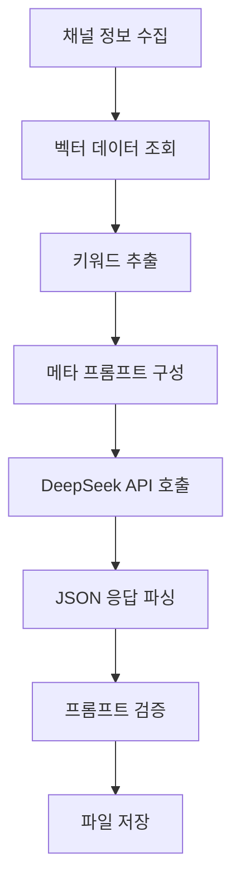

# 🤖 제로샷 프롬프트 자동 생성 시스템

AI가 채널 정보를 분석해서 **최적화된 프롬프트를 자동 생성**하는 시스템입니다.

## 🎯 목표

- **제로샷 접근**: 채널 정보만 주면 AI가 알아서 프롬프트 생성
- **맞춤 최적화**: 각 채널의 특성에 맞는 페르소나, 톤, 규칙 자동 설정
- **실용성**: 실제 사용 가능한 고품질 프롬프트 생성

## 🏗️ 시스템 구조

```
vault/90_indices/
├── zero_shot_prompt_generator.py  # 제로샷 AI 프롬프트 생성기
├── prompt_manager.py             # 프롬프트 관리 (룰 기반 + 제로샷 통합)
├── auto_prompt.py               # CLI 도구 (제로샷 옵션 추가)
├── test_zero_shot.py            # 테스트 스크립트
└── README_ZERO_SHOT.md          # 이 파일
```

## 🔧 설정

### 1. API 키 설정

`.env` 파일에 DeepSeek API 키 추가:

```bash
DEEPSEEK_API_KEY=your_api_key_here
DEEPSEEK_BASE_URL=https://api.deepseek.com
```

### 2. 의존성 설치

```bash
pip install openai python-dotenv chromadb
```

### 3. 벡터 임베딩 준비

```bash
cd vault/90_indices
python embed.py  # ChromaDB 벡터 생성
```

## 🚀 사용법

### 기본 명령어

```bash
# 사용 가능한 채널 확인
python auto_prompt.py list

# 특정 채널 제로샷 프롬프트 생성
python auto_prompt.py generate takaki_takehana -m zero_shot_ai

# 모든 채널 제로샷 프롬프트 일괄 생성
python auto_prompt.py batch -m zero_shot_ai

# 프롬프트 현황 확인
python auto_prompt.py status
```

### 방법 비교

| 방법 | 명령어 | 특징 |
|------|--------|------|
| **룰 기반** | `-m rule_based` | 빠름, 일관적, API 비용 없음 |
| **제로샷 AI** | `-m zero_shot_ai` | 창의적, 자연스러움, API 비용 있음 |

### 테스트

```bash
# 시스템 테스트
python test_zero_shot.py
```

## 📊 제로샷 생성 과정



## 🎨 생성 예시

### 입력 (채널 정보)
```yaml
채널명: takaki_takehana
총 문서: 145개
키워드: 부동산, 투자, 일본, 수익률, 분석
영상 제목: "도쿄 부동산 투자 전략", "수익률 계산법" 등
```

### 출력 (생성된 프롬프트)
```json
{
  "persona": "일본 부동산 투자 전문가이며 데이터 기반 분석을 중시하는 컨설턴트",
  "tone": "전문적이면서도 실용적인 조언을 제공하는 스타일",
  "system_prompt": "당신은 takaki_takehana 채널을 대표하는 일본 부동산 투자 전문 AI 어시스턴트입니다...",
  "rules": [
    "이 채널의 영상 내용만을 바탕으로 답변",
    "구체적인 수치와 데이터를 포함하여 답변",
    "실행 가능한 구체적 단계 제시"
  ],
  "output_format": {
    "structure": "🚀 핵심 요약 → 📊 데이터 분석 → 📚 근거/출처 → 📝 실행 단계 → 💡 한줄 요약",
    "max_bullets": 7,
    "include_video_links": true
  },
  "expertise_keywords": ["부동산", "투자", "수익률", "분석", "도쿄"],
  "target_audience": "일본 부동산 투자에 관심있는 한국인",
  "unique_value": "실제 일본 현지 경험과 데이터 기반 투자 인사이트 제공"
}
```

## 💰 비용 예상

| 채널 수 | 예상 비용 (USD) | 설명 |
|---------|-----------------|------|
| 1개 | $0.01-0.05 | 테스트용 |
| 10개 | $0.10-0.50 | 소규모 |
| 50개 | $0.50-2.50 | 대규모 |

*DeepSeek API 기준, 실제 비용은 채널 크기에 따라 달라질 수 있음*

## 🔍 문제 해결

### API 키 오류
```bash
❌ DEEPSEEK_API_KEY 또는 OPENAI_API_KEY 환경변수가 필요합니다
```
**해결**: `.env` 파일에 API 키 설정 확인

### ChromaDB 경로 오류
```bash
❌ ChromaDB 로드 실패
```
**해결**: `python embed.py` 먼저 실행

### JSON 파싱 오류
```bash
❌ AI 응답 파싱 실패
```
**해결**: 자동으로 폴백 프롬프트 생성됨, 재시도 권장

## 📈 성능 비교

| 메트릭 | 룰 기반 | 제로샷 AI |
|--------|---------|-----------|
| **생성 속도** | 1-2초 | 10-30초 |
| **창의성** | ⭐⭐ | ⭐⭐⭐⭐⭐ |
| **일관성** | ⭐⭐⭐⭐⭐ | ⭐⭐⭐ |
| **맞춤화** | ⭐⭐⭐ | ⭐⭐⭐⭐⭐ |
| **비용** | 무료 | 유료 |

## 🎛️ 고급 설정

### 다른 모델 사용

```python
# GPT-4 사용
generator = ZeroShotPromptGenerator(model="gpt-4")

# GPT-3.5 사용 (저비용)
generator = ZeroShotPromptGenerator(model="gpt-3.5-turbo")
```

### 메타 프롬프트 커스터마이징

`zero_shot_prompt_generator.py`의 `_build_meta_prompt()` 메서드 수정

## 🔮 향후 계획

- [ ] **다국어 지원**: 영어, 일본어 채널 대응
- [ ] **프롬프트 평가**: 자동 품질 점수 계산
- [ ] **A/B 테스트**: 룰 기반 vs 제로샷 성능 비교
- [ ] **템플릿 학습**: 성공한 프롬프트 패턴 학습
- [ ] **실시간 최적화**: 사용 피드백 기반 개선

## 🤝 기여

1. 버그 리포트: 테스트 스크립트 실행 후 결과 공유
2. 프롬프트 개선: 생성된 프롬프트 품질 피드백
3. 새 기능 제안: 다른 생성 방법이나 최적화 아이디어

## 📚 참고 자료

- [DeepSeek API 문서](https://platform.deepseek.com/api-docs/)
- [OpenAI API 호환성](https://platform.openai.com/docs/api-reference)
- [ChromaDB 가이드](https://docs.trychroma.com/)

---

**제로샷 프롬프트 생성으로 더 스마트한 지식 데이터 허브를 만들어보세요! 🚀** 